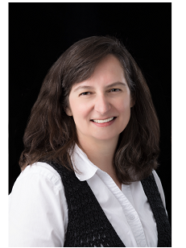

<figure>

### **Susie Arnholt**

</figure>

### **Contact Information:**
Office: Walker Hall, RM 242  
Phone: (828) 262-2360 
Email: [arnholtsr@appstate.edu](mailto:arnholtsr@appstate.edu) 

### **Senior Lecturer**

M.S. in Statistics - University of North Carolina, Chapel Hill

### **Primary Field:**

Probability, Statistics, Teaching, Making good decisions with data, R programming

  

### **About Susie Arnholt:**

After completing her MS at the University of North Carolina at Chapel Hill, Mrs. Arnholt (then Miss Whitney) moved to Boone with the intention of securing a teaching position.  After working at both Caldwell Community College and Lees McRae College, Mrs. Arnholt was hired to teach at Appalachian State in 1996.

She married [Dr. Arnholt](https://alanarnholt.github.io/) in May 1997.  They have two daughters.

Mrs. Arnholt teaches primarily Introductory Statistics, Statistical Methods I, and Probability.  She uses technology including R, LaTeX, Minitab, Excel, Stat Crunch, and others, in her classes to make computations less tedious and to spend more time on statistical and probabilistic concepts.  Teaching students how to think critically about information and how to make good decisions with data by discovering truth are the bedrock of her teaching.

<footer, style="padding-top : 80px;">

-------

[Department of Mathematics](http://mathsci.appstate.edu)

Walker Hall --- 121 Bodenheimer Drive --- Boone, NC 28608

[Appalachian State University](http://www.appstate.edu)

</footer>
